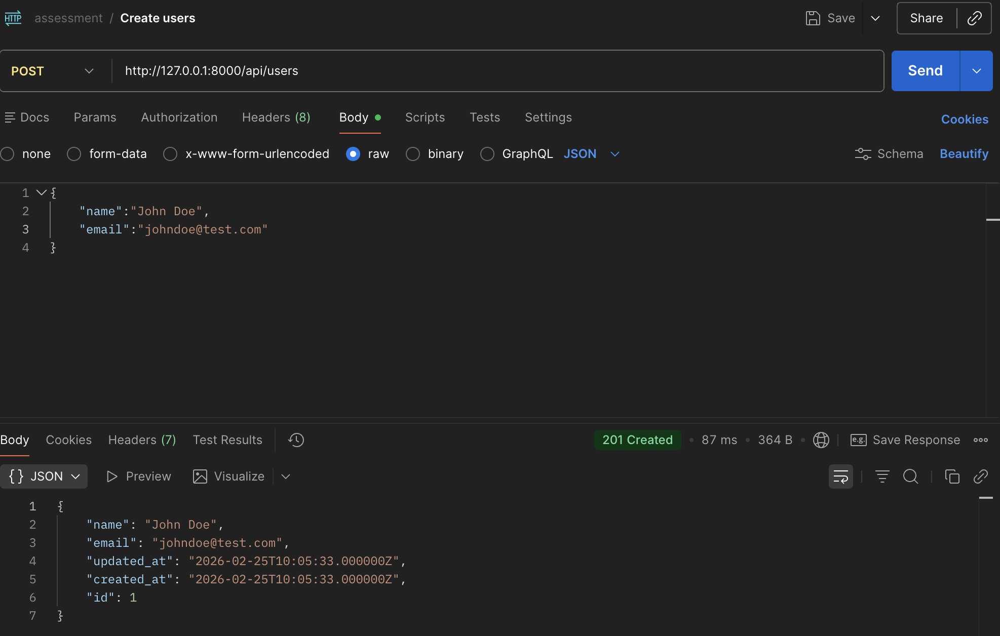
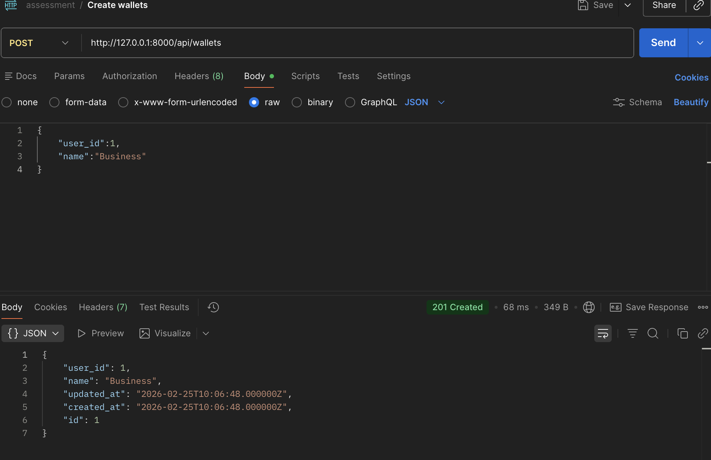
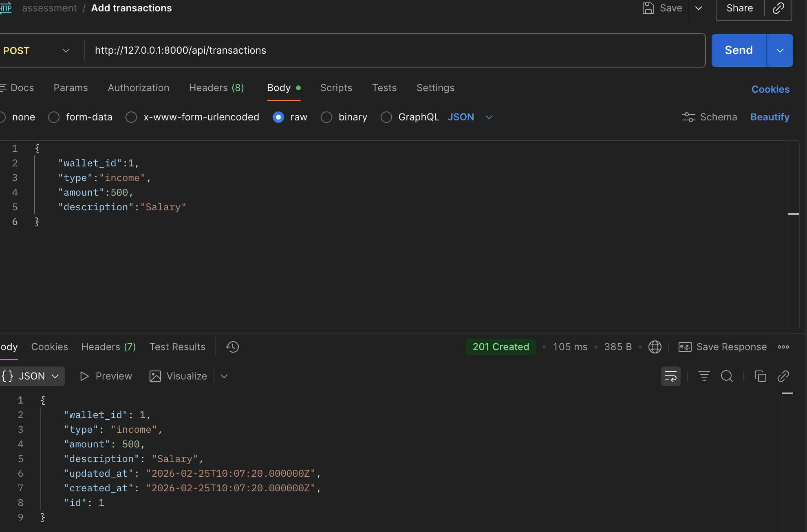
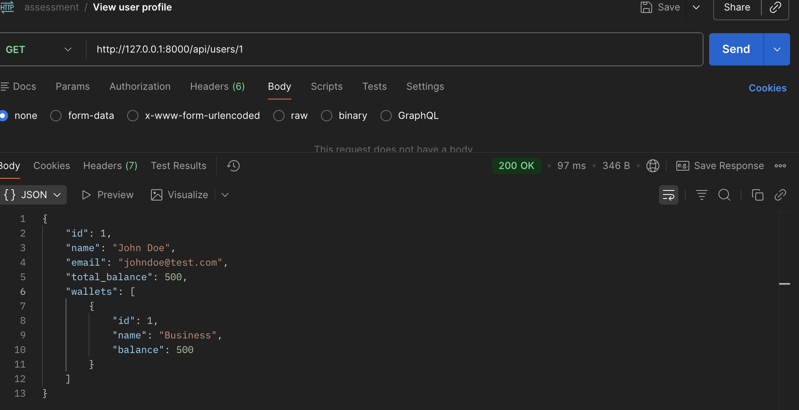
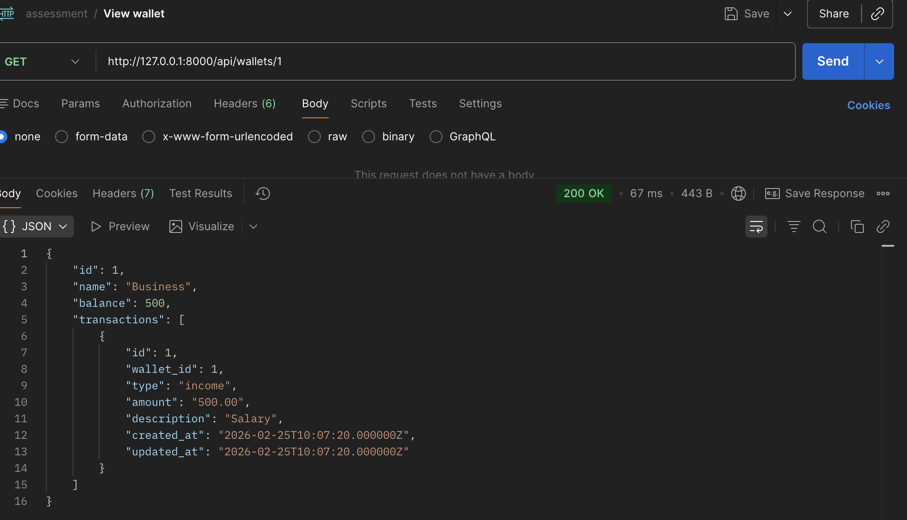

# Money Tracker API

A simple REST API built with Laravel that lets users manage wallets and track income and expense transactions.

## Stack

- PHP 8.2+
- Laravel 11
- MySQL

## Setup

```bash
git clone https://github.com/your-username/money-tracker.git
cd money-tracker
composer install
cp .env.example .env
php artisan key:generate
```

Update your `.env` with your database credentials, then:

```bash
php artisan install:api
php artisan migrate
php artisan serve
```

API runs at `http://127.0.0.1:8000/api`

## Endpoints

| Method | Endpoint | Description |
|--------|----------|-------------|
| POST | `/api/users` | Create a user |
| GET | `/api/users/{id}` | View user profile with wallets and total balance |
| POST | `/api/wallets` | Create a wallet |
| GET | `/api/wallets/{id}` | View wallet with balance and transactions |
| POST | `/api/transactions` | Add an income or expense transaction |

## API Screenshots

### Create User


### Create Wallet


### Add Transaction


### View User Profile


### View Wallet


## Running Tests

```bash
php artisan test
```